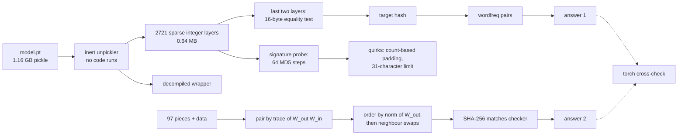
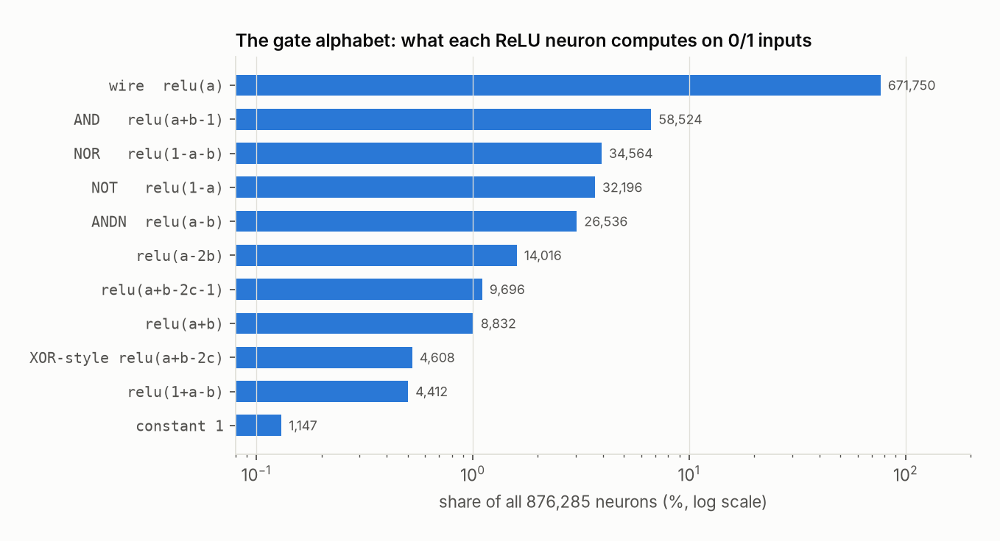
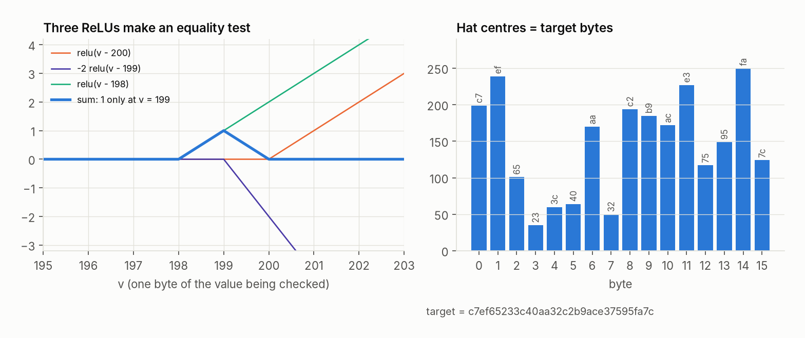
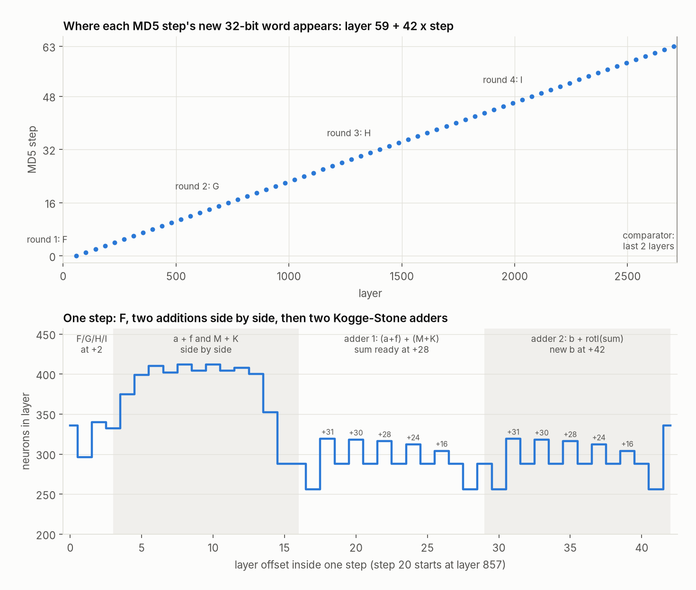
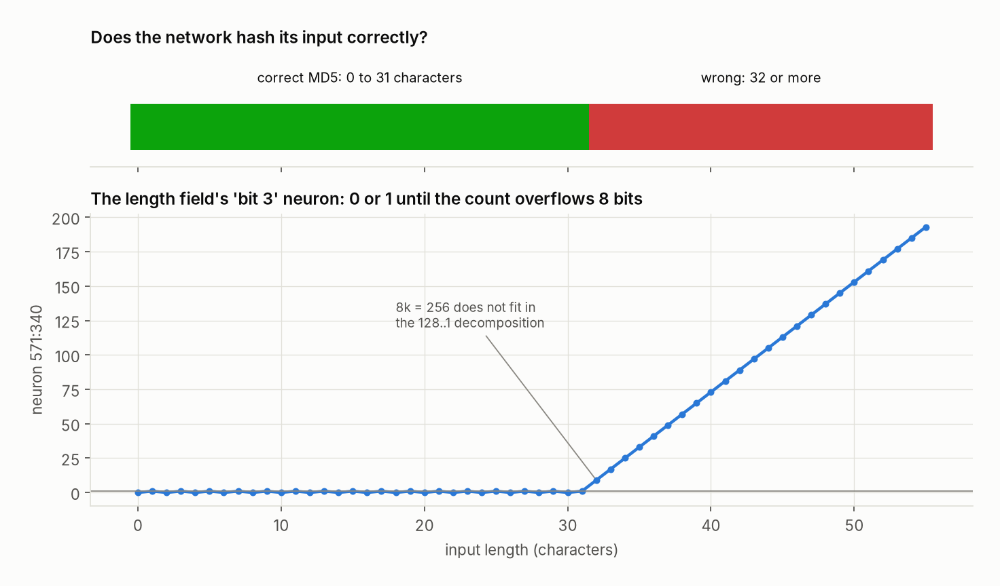
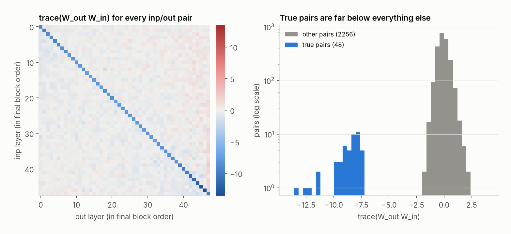
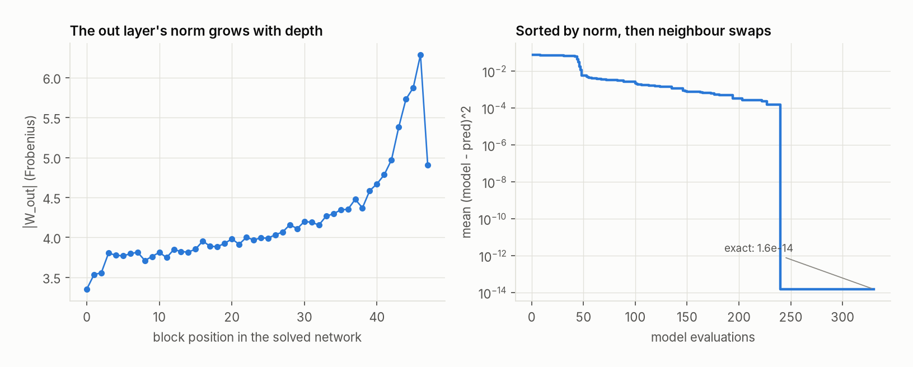

# Reverse engineering Jane Street's neural network puzzles

Jane Street has published two puzzles that hand you a neural network and ask what it is hiding:

1. **[The burial mound network](https://huggingface.co/spaces/jane-street/puzzle)** (March 2025, write-up
   [Can you reverse engineer our neural network?](https://blog.janestreet.com/can-you-reverse-engineer-our-neural-network/)).
   A 1.16 GB PyTorch model with every weight visible. It returns 0 for almost every input. Find the
   input that makes it say something else.
2. **[I dropped a neural net](https://huggingface.co/spaces/jane-street/droppedaneuralnet)** (January 2026).
   A residual network broken into 97 shuffled linear layers, plus 10,000 rows of its historical data.
   Put the layers back in order.

This repository solves both from the raw files. Every step is a script you can run, and every
number in this README apart from run times is asserted by a test. The aim is that someone who has
never opened a `.pt` file can follow the whole chain: bytes, weights, circuit, meaning, answer.

```
git clone https://github.com/danieltyukov/jane-street-neural-net-puzzle
cd jane-street-neural-net-puzzle
make setup fetch   # Python venv + both puzzles from Hugging Face (1.2 GB, SHA-256 checked)
make all           # both solves, about 30 s on a 22-core desktop
```

<details>
<summary>The answers (spoilers)</summary>

Puzzle 1 is a hand-built MD5 circuit. The input it accepts is **`bitter lesson`**.

Puzzle 2 is solved by the permutation

`43,34,65,22,69,89,28,12,27,76,81,8,5,21,62,79,64,70,94,96,4,17,48,9,23,46,14,33,95,26,50,66,1,40,15,67,41,92,16,83,77,32,10,20,3,53,45,19,87,71,88,54,39,38,18,25,56,30,91,29,44,82,35,24,61,80,86,57,31,36,13,7,59,52,68,47,84,63,74,90,0,75,73,11,37,6,58,78,42,55,49,72,2,51,60,93,85`

whose SHA-256 is the one the puzzle's own checker expects
(`093be1cf2d24094db903cbc3e8d33d306ebca49c6accaa264e44b0b675e7d9c4`).

</details>

## What is in here

| Step | Command | What it does |
|---|---|---|
| Fetch | `nnre fetch` | Downloads both puzzles at pinned Hugging Face revisions and checks their SHA-256 |
| Unpickle | `nnre unpickle` | Reads `model.pt` without executing it and decompiles the hidden forward wrapper |
| Census | `nnre census` | Shows the weights are small integers and names the ReLU "gates" the network is made of |
| Readout | `nnre readout` | Reads the target out of the last two layers and checks the network computes MD5 |
| MD5 map | `nnre md5map` | Finds all 64 MD5 steps inside the network, one every 42 layers |
| Quirks | `nnre quirks` | Explains where the network stops being MD5 (NULs, 32+ characters) |
| Crack | `nnre crack` | Finds the two words whose MD5 is the target |
| Pair | `nnre pair` | Puzzle 2: matches every `inp` layer with its `out` layer |
| Order | `nnre order` | Puzzle 2: orders the 48 blocks and checks the answer against the puzzle's hash |
| Cross-check | `nnre crosscheck` | Runs the real PyTorch modules and compares (needs `make torch`) |

`nnre all` runs all of them and writes `build/results.json` and `build/results.log`.

The long walkthrough, including the wrong turns, is in [docs/WRITEUP.md](docs/WRITEUP.md). How to
poke at the files yourself (pickletools, Netron, torch) is in [docs/TOOLS.md](docs/TOOLS.md).



## Puzzle 1: the network that hides a hash

### 1. Opening the file without running it

A `.pt` file is a zip archive. Inside, `data.pkl` is a Python pickle that describes the object graph
and `data/<n>` holds the raw tensor bytes. Loading a pickle can run arbitrary code, and this one is
saved with `weights_only=False`, so the first job is to look without executing.
[`src/nnre/torchzip.py`](src/nnre/torchzip.py) does two things:

- unpickles with every class and function replaced by an inert placeholder that only records how
  it was called (the only real objects it builds are plain containers, `OrderedDict` and `set`, and
  the bytes they hold), then reads each tensor's storage bytes into numpy;
- lists every `module.name` the pickle asked for along the way, which is the complete set of code
  the file could have run.

The pickle asks for `Sequential`, `Linear`, `ReLU`, the tensor rebuilders, and four `cloudpickle`
helpers. [cloudpickle](https://github.com/cloudpipe/cloudpickle) can save a function as its raw
bytecode, and that is what these helpers rebuild. `nn.Module.__call__` runs `self._call_impl`, and
Jane Street replaced that attribute on this model, which is how `model("vegetable dog")` accepts
text. Decompiled from its CPython 3.10 bytecode ([`src/nnre/pybytecode.py`](src/nnre/pybytecode.py)):

```python
lambda x: model.forward(torch.Tensor(list(map(ord, str(x)[:55].ljust(55, '\x00')))))
```

So the input is the code points of the first 55 characters, padded with NULs. 55 is exactly the
longest message that fits in one 64-byte MD5 block, which is the first hint.

> **MD5 in brief.** MD5 pads a message into 64-byte blocks: the message, one `0x80` byte, zeros, and
> the message length in bits as an 8-byte number at the end. A message of up to 64 - 1 - 8 = 55
> bytes fits in one block. The block is read as 16 little-endian 32-bit words `M[0..15]`. Four
> registers `a, b, c, d` start from fixed constants (the IV) and go through 64 steps. Step `i`
> computes `f = F(b, c, d)` (F, G, H or I depending on the round of 16 steps) and sets
> `b = b + rotl(a + f + K[i] + M[g], s)`, where `K[i]` and the rotation `s` are constants and `g`
> picks a message word; the other registers shift along. At the end the IV is added back, and the
> four registers are the 16-byte digest.

### 2. A circuit dressed as a network

Under the wrapper are 2721 `Linear` layers, each followed by `ReLU`. Every weight is 0 or a power of
two between -256 and 128, every bias is an integer, and only 0.37% of the 288 million weights are
non-zero. Stored sparsely the whole network is 0.64 MB.

With 0/1 inputs a single ReLU neuron is a logic gate, and the network uses only a handful of them:



77% of the neurons are wires that copy a value one layer forward (ReLU networks have no skip
connections, so every value needed later has to be carried). XOR never gets its own neuron: it is
written as `a + b - 2*AND(a, b)`, which is linear in `a`, `b` and `AND(a, b)`, so the following
layer's weights apply it.

### 3. The last two layers

Jane Street's hint was to start at the end. The last layer is 16 copies of one trick: for an integer
`v`, `relu(v-t+1) - 2*relu(v-t) + relu(v-t-1)` is 1 when `v == t` and 0 otherwise. Sixteen of these
"hats" are added, 15 is subtracted, and a final ReLU gives 1 only if all 16 bytes match.



The hat centres spell `c7ef65233c40aa32c2b9ace37595fa7c`. Reading the value the comparator checks
(the shared input of each hat) for 200 random inputs gives exactly `MD5(input)` every time. Eight of
the 16 bytes arrive with their last XOR still undone, as `a + b` and `AND(a, b)` side by side; the
comparator's weights finish it, which is why some of them are -2, -4, ..., -256.

### 4. Finding MD5 inside

Knowing what to look for, we can find it. Run a batch of random inputs. A neuron's *signature* is
its list of values across the batch. If one bit of some MD5 intermediate word has the same
signature as a neuron, that neuron carries that bit: for a bit that looks random, 160 matching coin
flips do not happen by chance. (Quantities that are genuinely equal do share signatures; the
write-up has an example.) ([`src/nnre/hashnet/probe.py`](src/nnre/hashnet/probe.py))



All 64 MD5 steps are there, exactly 42 layers apart: step `i`'s new word is complete at layer
`59 + 42*i`. Inside a step:

- the round function (F, G, H or I) is ready 2 layers in (from step 3 on; earlier steps still have
  constant IV words among its inputs);
- the widest stretch computes `a + f` and `M[g] + K[i]` side by side, so that what is left is a
  sum of two numbers;
- two 32-bit Kogge-Stone adders follow: one for `(a + f) + (M + K)`, one for `b + rotl(sum, s)`.

Adding two numbers is slow if each carry waits for the one below it. A bit position *generates* a
carry if both input bits are 1 and *propagates* an incoming carry if exactly one is. A Kogge-Stone
adder combines these (generate, propagate) pairs over spans of 1, 2, 4, 8 and 16 bits, so all 32
carries are known after five levels instead of 32 steps. Level `k` updates `32 - 2^k` bit positions:
31, 30, 28, 24, 16, which is exactly how much the layer width rises above its floor in every adder
of every step.

One thing a neuron-by-neuron search cannot see: the sum `a + f + K[i] + M[g]` before the rotation is
never stored in single neurons (at most 1 of its 32 bits, in all 31 steps after the first that read
one of the words carrying characters). A **linear probe** finds it: at offset 28 inside a step, all
32 bits are exact linear combinations of that layer's neurons, while one layer earlier only 1 is
(checked in steps 5, 20, 37 and 60). It is the XOR trick again. Each sum bit lives in a direction,
not a neuron, and the rotation is free because it is just a choice of which neurons feed the next
adder.

The network also never keeps the 32 bits of a message word around. It carries the input bytes on
wires and turns them into bits again each time a step needs the word.

### 5. Where it stops being MD5

Jane Street's write-up mentions that one solver found the network mishandles long inputs. The cause
is visible in the first two layers. Layer 0 builds `x - relu(x-1)`, which is 1 for any non-NUL character, and layer 1
neuron 224 adds those up times 8. That count `k`, not the position of the first NUL, decides both
where the `0x80` padding byte is added and what goes in MD5's length field. The length `8k` is then split
into bits by "subtract 128 if at least 128, subtract 64 if at least 64, ...". That handles at most
255, so at most 31 characters:



From 32 characters on, the lowest stage keeps the overflow (9 for 32 characters, 193 for 55) instead
of a 0 or 1, and the result is not a hash of anything. Strings with NULs inside are hashed with the
count-based padding: `md5.network_md5` reproduces the network for all 300 such test strings, plain
MD5 for none. One more corner: the marker is *added* to the byte at position `k`, so if a code point
of 128 or more sits there (possible only with NULs inside), the byte overflows the same 8-bit
splitter.

### 6. The answer

MD5 has no practical preimage attack and the network's output is flat zero, so gradients are no
help either. The puzzle
page pre-fills `vegetable dog` with the comment `# two words?`, so the search space is pairs of
English words. Taking words from [wordfreq](https://github.com/rspeer/wordfreq) and trying pairs in
order of their rarer word's rank finds the phrase after 24 million guesses, a few seconds on a
multi-core machine. The network outputs 1 for it, and 0 for the capitalised version, the plural, or
an extra space.

## Puzzle 2: the dropped network

Each block is `x + out(relu(inp(x)))`, with `inp` 48 to 96 and `out` 96 to 48. The 48-number
vector `x` that flows through the blocks, with each one adding its output to it, is the *residual
stream*. There are 48 layers of each kind, plus one 48 to 1 final layer. The answer is the order of
all 97 pieces.

### 1. Pairing

Any `inp` composes with any `out`, so shapes do not help. But hidden unit `k` reads along row `k`
of `W_in` and writes along column `k` of `W_out`, and those two vectors were trained together.
`trace(W_out @ W_in)` adds up read-dot-write over the 96 units. For a wrong pair the terms are
unrelated and cancel; for a true pair they do not:



True pairs score between -13.5 and -7.4, everything else sits around 0, and the smallest gap is
5.8. The negative sign means each unit pushes back against the direction it reads. The matching
itself is the standard assignment problem, solved with the Hungarian algorithm (simply taking each
row's minimum gives the same answer here).

### 2. Ordering

The data includes `pred`, the original model's output, so the right order is the one that reproduces
`pred` exactly. A greedy build plus "move one block to its best position" search finds it, but takes
about 13 minutes (`nnre order --method search`). Once solved, the size of each `out` layer (its
Frobenius norm, the square root of the sum of its squared weights) turns out to rise with depth: the
Spearman rank correlation with the true position is 0.986, where 1 would be perfectly increasing.
Sorting by it gets within 48 neighbour swaps of the answer, and swapping neighbours while the error
drops finishes the job in about ten seconds:



The reassembled network matches `pred` to 1.6e-6 on all 10,000 rows, and to 4.8e-7 when run in
float32 with the original PyTorch classes (closer, because `pred` itself was computed in float32).
The SHA-256 of the answer equals the hash hard-coded in the puzzle's checker.

Both signals, the negative diagonal of `W_out W_in` and `|W_out|` as a depth proxy, are also the
basis of Hyunwoo Park's paper [I Dropped a Neural Net](https://arxiv.org/abs/2602.19845), which
explains the first through training dynamics.

## Cross-checks

`make torch` installs CPU PyTorch, and `nnre crosscheck` then compares against the real thing:

- Puzzle 1: after checking the file's SHA-256, torch loads `model.pt` through an allowlisting
  unpickler that refuses everything except the classes a Linear/ReLU stack needs and swaps the
  cloudpickle helpers for a dummy. Torch's own `Sequential.forward` gives exactly the numpy
  simulator's values on 64 inputs, at the output and at all 192 comparator inputs. Only
  `bitter lesson` gives 1.
- Puzzle 2: the `Block` and `LastLayer` classes copied from the puzzle page, loaded with
  `weights_only=True`, reproduce `pred`.

## Repository layout

```
src/nnre/
  fetch.py         pinned downloads from Hugging Face with SHA-256 checks
  torchzip.py      inert unpickler and torch zip reader (numpy, no torch)
  pybytecode.py    CPython 3.10 decompiler for the forward wrapper
  hashnet/
    model.py       the 2721-layer network as sparse matrices, batched simulator
    census.py      neuron patterns and gate names
    readout.py     the 16-byte equality test in the last two layers
    md5.py         reference MD5 with step traces, and the network's padding rule
    probe.py       signature index, MD5 map, linear probe, message schedule
    quirks.py      NUL handling and the 32-character limit
    crack.py       two-word search ordered by word frequency
  dropped/
    load.py        pieces and historical data
    pair.py        trace(W_out W_in) matching
    order.py       norm start, swaps, insertion search, answer hash
  crosscheck.py    comparisons against PyTorch
  figures.py       everything in docs/img
  pipeline.py      the steps behind the CLI
tests/             unit tests and end-to-end checks of every claim above
docs/              the write-up, tool notes and figures
data/              downloaded puzzle files (not in git)
```

## Requirements

- Python 3.10 or newer
- About 1.2 GB of disk for the downloads
- Optional: PyTorch for `nnre crosscheck` (`make torch` installs the CPU build)

## Links

- Puzzle 1: <https://huggingface.co/spaces/jane-street/puzzle>, model files at
  <https://huggingface.co/jane-street/2025-03-10>
- Puzzle 2: <https://huggingface.co/spaces/jane-street/droppedaneuralnet>
- Jane Street's write-up of puzzle 1: <https://blog.janestreet.com/can-you-reverse-engineer-our-neural-network/>
- Hyunwoo Park, *I Dropped a Neural Net*: <https://arxiv.org/abs/2602.19845>
- Yi Wang's solve of puzzle 2 with Gumbel-Sinkhorn: <https://wangyi.ai/blog/2026/02/16/solving-jane-street-dropped-neural-net/>
- The companion repo for Jane Street's ASIC puzzle: <https://github.com/danieltyukov/jane-street-asic-puzzle>

## License

MIT for the code in this repository. The puzzle files belong to Jane Street (published under MIT on
Hugging Face) and are downloaded by `make fetch`, not copied here.
